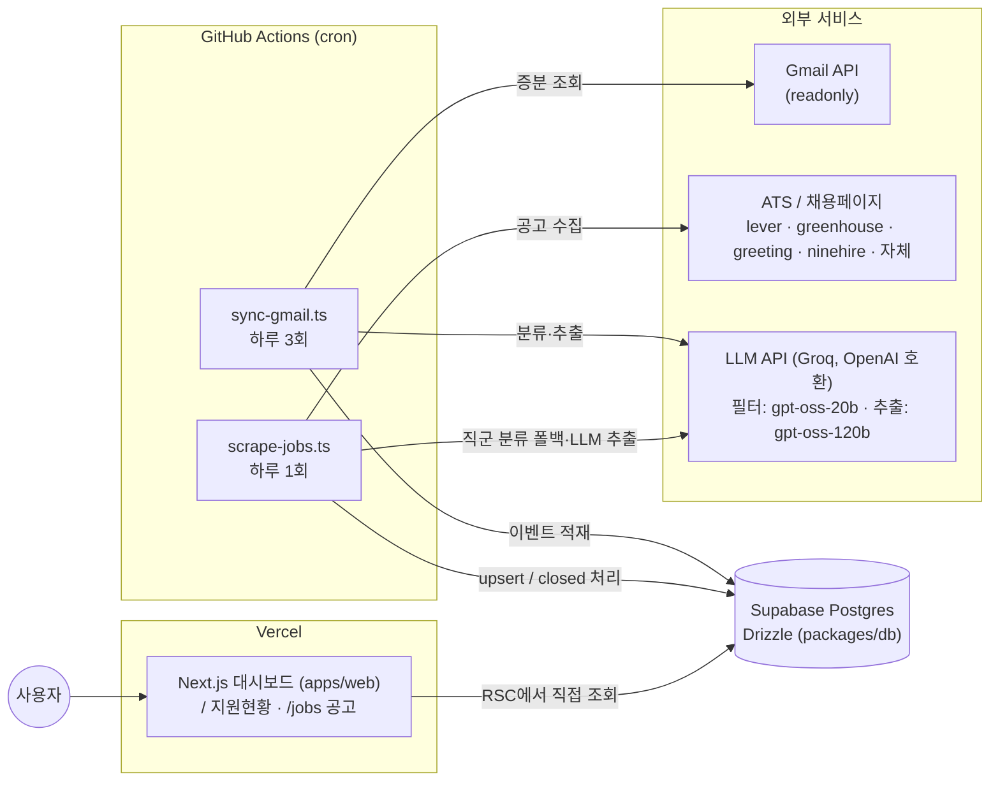

# 입사지원 트래커 (Job Application Tracker)

개인용 입사지원 현황 대시보드 + 채용공고 수집 서비스.

- **웹 대시보드** — 지원현황(`/`)과 채용공고(`/jobs`)를 보여주는 Next.js 앱. Vercel 배포
- **메일 수집 워커** — Gmail을 증분 조회해 지원 관련 메일을 LLM으로 분류하고 이벤트 로그로 적재. GitHub Actions cron (하루 3회)
- **공고 스크래퍼 워커** — 관심 기업의 ATS/채용페이지에서 개발 직군 공고를 수집. GitHub Actions cron (하루 1회)

상시 서버는 없다. 워커는 Actions 러너에서 `tsx`로 실행되고, 상태는 전부 Supabase(Postgres)에 있다.
상세 요구사항은 [docs/spec.md](docs/spec.md)가 유일한 소스다.

## 아키텍처



### 모노레포 구조

```
apps/
  web/         # Next.js 대시보드 (RSC 우선, shadcn/ui, Recharts)
  worker/      # cron 진입점 (sync-gmail.ts, scrape-jobs.ts)
packages/
  shared/      # 공용 enum·Zod 스키마·LLM 클라이언트·유틸
  db/          # Drizzle 스키마 + 클라이언트 (web/worker 공유)
  scraper/     # ATS별 스크래핑 어댑터 (registry 패턴)
.github/workflows/
  ci.yml           # push/PR: typecheck → test → web build
  sync-gmail.yml   # cron 하루 3회 (KST 09/15/21시)
  scrape-jobs.yml  # cron 하루 1회 (KST 06시)
```

## 로컬 셋업

### 요구사항

- Node.js 24, pnpm 10 (`corepack enable`이면 `package.json`의 `packageManager`로 버전이 고정된다)

### 1. 설치

```bash
corepack enable
pnpm install
```

### 2. Supabase(DB) 연결

1. [Supabase](https://supabase.com) 프로젝트 생성 (무료 티어)
2. Project Settings → Database에서 커넥션 문자열을 복사한다.
   워커·마이그레이션에는 **Transaction pooler (pgbouncer, 6543 포트)** URL을 그대로 써도 된다 —
   `packages/db`의 클라이언트가 `prepare: false`로 pgbouncer에 대응한다.
3. 루트에 `.env`를 만들고 채운다 (`.env.example` 참고):

   ```bash
   cp .env.example .env
   ```

4. 스키마 반영:

   ```bash
   DATABASE_URL='postgres://...' pnpm --filter @job-tracker/db db:push
   # 또는 SQL 마이그레이션 파일 생성: pnpm --filter @job-tracker/db db:generate
   ```

### 3. Gmail OAuth (refresh token 발급)

메일 수집 워커는 OAuth 2.0 refresh token 방식이다 (스코프: `gmail.readonly`). 최초 1회만 로컬에서 발급한다.

1. [Google Cloud Console](https://console.cloud.google.com)에서 프로젝트 생성 → Gmail API 활성화
2. OAuth 동의 화면 구성(테스트 사용자에 본인 계정 추가) → OAuth 클라이언트 ID 생성(데스크톱 앱) → Client ID/Secret 확보
3. 토큰 발급 스크립트 실행 (브라우저가 열리고 동의하면 refresh token이 출력된다):

   ```bash
   GMAIL_CLIENT_ID=... GMAIL_CLIENT_SECRET=... \
     pnpm --filter @job-tracker/worker exec tsx scripts/gmail-auth.ts
   ```

4. 출력된 refresh token을 `.env`의 `GMAIL_REFRESH_TOKEN`과 GitHub Secrets에 저장한다.

### 4. 환경변수

`.env.example`이 전체 목록이다.

| 변수 | 사용처 | 설명 |
|---|---|---|
| `DATABASE_URL` | web, worker, db | Supabase Postgres 커넥션 문자열 |
| `GMAIL_CLIENT_ID` / `GMAIL_CLIENT_SECRET` | worker | Google OAuth 클라이언트 |
| `GMAIL_REFRESH_TOKEN` | worker | 위 3번에서 발급 |
| `LLM_BASE_URL` | worker | 기본 `https://api.groq.com/openai/v1` (OpenAI 호환이면 교체 가능) |
| `LLM_API_KEY` | worker | LLM API 키 |
| `LLM_MODEL_FILTER` | worker | 메일 1차 필터·직군 분류 폴백용 저가 모델 (기본 `openai/gpt-oss-20b`) |
| `LLM_MODEL_EXTRACT` | worker | 메일 stage 추출·공고/정책 추출용 모델 (기본 `openai/gpt-oss-120b`) |

### 5. 실행

```bash
pnpm --filter @job-tracker/web dev          # 대시보드 http://localhost:3000
pnpm --filter @job-tracker/worker sync-gmail   # 메일 수집 1회 실행
pnpm --filter @job-tracker/worker scrape-jobs  # 공고 스크래핑 1회 실행
pnpm typecheck && pnpm test                 # 전체 검증 (turbo)
```

## GitHub Secrets

워크플로(`sync-gmail.yml`, `scrape-jobs.yml`)가 repository secrets에서 주입받는다.
Settings → Secrets and variables → Actions에 등록:

| Secret | 필수 | 비고 |
|---|---|---|
| `DATABASE_URL` | O | 두 워커 공용 |
| `GMAIL_CLIENT_ID` | O | sync-gmail 전용 |
| `GMAIL_CLIENT_SECRET` | O | sync-gmail 전용 |
| `GMAIL_REFRESH_TOKEN` | O | sync-gmail 전용 |
| `LLM_API_KEY` | O | 두 워커 공용 |
| `LLM_BASE_URL` | X | 미설정 시 워크플로 기본값(Groq) 사용 |
| `LLM_MODEL_FILTER` | X | 미설정 시 `openai/gpt-oss-20b` |
| `LLM_MODEL_EXTRACT` | X | 미설정 시 `openai/gpt-oss-120b` |

스케줄은 워크플로 파일의 cron(UTC)에 있다: sync-gmail은 `0 0,6,12 * * *`(KST 09/15/21시), scrape-jobs는 `0 21 * * *`(KST 06시). 두 워크플로 모두 `workflow_dispatch`로 Actions 탭에서 수동 실행할 수 있고, `concurrency`로 중복 실행이 큐잉된다.

## Vercel 배포 (apps/web)

1. Vercel에서 레포 import
2. **Root Directory를 `apps/web`으로 설정** — pnpm workspace 모노레포는 Vercel이 자동 감지하며, 루트의 lockfile로 워크스페이스 의존성(`@job-tracker/db`, `@job-tracker/shared`)까지 설치한다. Framework Preset은 Next.js(자동 감지), install/build 커맨드는 기본값 그대로
3. Environment Variables에 `DATABASE_URL` 등록 (basic auth를 쓰면 `BASIC_AUTH_USER`, `BASIC_AUTH_PASSWORD`도)

### 접근 보호 (basic auth 미들웨어)

개인용이므로 별도 인증 없이 basic auth 미들웨어 정도만 둔다. `apps/web/middleware.ts`를 추가하면 된다:

```ts
// apps/web/middleware.ts
import { NextRequest, NextResponse } from "next/server";

export function middleware(request: NextRequest) {
  const user = process.env.BASIC_AUTH_USER;
  const password = process.env.BASIC_AUTH_PASSWORD;
  if (!user || !password) return NextResponse.next(); // 미설정 시 보호 없음 (로컬 개발)

  const header = request.headers.get("authorization");
  if (header?.startsWith("Basic ")) {
    const [u, p] = atob(header.slice(6)).split(":");
    if (u === user && p === password) return NextResponse.next();
  }
  return new NextResponse("Authentication required", {
    status: 401,
    headers: { "WWW-Authenticate": 'Basic realm="job-tracker"' },
  });
}

export const config = {
  // 정적 자산은 제외하고 페이지·Server Action만 보호
  matcher: ["/((?!_next/static|_next/image|favicon.ico).*)"],
};
```

## 분류 정확도 평가셋

모델 교체나 프롬프트 수정 시 메일 분류 정확도의 회귀를 확인하는 용도다.

- 실제 수신한 채용 메일 20~30통을 `apps/worker/fixtures/emails/`에 저장한다.
  **실제 메일 원문이므로 git에 커밋하지 않는다** — 해당 경로는 `.gitignore`에 이미 등록돼 있다.
- 각 메일에 기대 stage 정답(`applied`, `document_passed`, `rejected` 등 스펙 4장 enum)을 붙여 두고,
  평가 스크립트가 fixture 전체를 LLM 파이프라인에 통과시켜 정답 대비 정확도를 출력한다.
- 모델 간 비교는 코드 수정 없이 env만 바꿔 재실행하면 된다:

  ```bash
  LLM_MODEL_EXTRACT=openai/gpt-oss-120b pnpm --filter @job-tracker/worker eval
  LLM_MODEL_EXTRACT=other-vendor/model  LLM_BASE_URL=https://... pnpm --filter @job-tracker/worker eval
  ```

  (평가 스크립트 이름은 worker 패키지의 `package.json` scripts를 기준으로 한다)
